<div align="center">


[](https://git.io/typing-svg)

<br/>

[](https://flutter.dev)
[](https://fastapi.tiangolo.com)
[](https://groq.com)
[](https://qdrant.tech)
[](https://ollama.com)
[](#-supported-languages)

<br/>

> *A warm, knowledgeable AI companion for women's health — accessible in 29 languages, free and open-source* 🌸

</div>

---

## 📋 Table of Contents

<div align="center">

| | | |
|:---:|:---:|:---:|
| [🌸 About](#-about) | [📦 Project Versions](#-project-versions) | [✨ Features](#-features) |
| [🏗️ Architecture](#%EF%B8%8F-architecture) | [🛠️ Tech Stack](#%EF%B8%8F-tech-stack) | [📊 Evaluation](#-evaluation-results) |
| [📸 Screenshots](#-screenshots) | [🌍 Languages](#-supported-languages) | [📁 Project Structure](#-project-structure) |
| [🚀 Getting Started](#-getting-started) | [▶️ Running the App](#%EF%B8%8F-running-the-app) | [📡 API Reference](#-api-reference) |

</div>

---

## 🌸 About


**Aurora** is a RAG-based multilingual conversational AI system designed to provide **accessible, accurate and empathetic women's healthcare guidance**.

Built as a capstone project, Aurora combines a **Flutter mobile frontend** with a **FastAPI backend** powered by:
- 🧠 Groq's **LLaMA 3.1** for response generation
- 📦 **Qdrant** vector database for medical knowledge
- 🎙️ Groq **Whisper** for voice transcription

Aurora speaks like a **caring, informed friend** — never clinical or cold — and supports **29 languages including 22 Indian regional languages**, making healthcare information accessible to millions of underserved women.

<br clear="right"/>

---

## 📦 Project Versions

<table>
  <tr>
    <td width="50%" valign="top">
      <h3>🖥️ Phase 1 — Streamlit Web App</h3>
      <p><code>Streamlit_Web_App/</code></p>
      <p>The initial prototype used to validate the RAG pipeline and multilingual capabilities. Served as the foundation for testing query routing, RAGAS evaluations, and fine-tuning the pipeline before mobile development.</p>
      <h4>Run the Streamlit app:</h4>

```bash
cd Streamlit_Web_App
streamlit run app.py
```
    </td>
    <td width="50%" valign="top">
      <h3>📱 Phase 2 — Flutter + FastAPI</h3>
      <p><code>Backend_FastAPI/ + frontend_flutter/</code></p>
      <p>The production version — a full Flutter mobile app with real-time WebSocket streaming, voice input, dark/light theme, persistent chat history, and a decoupled FastAPI backend.</p>
      <h4>Key upgrade:</h4>
      <ul>
        <li>⚡ Real-time token streaming</li>
        <li>🎙️ Voice-to-text via Whisper</li>
        <li>🌓 Dark/Light theme support</li>
        <li>💾 Persistent chat history (Hive)</li>
      </ul>
    </td>
  </tr>
</table>

---

## ✨ Features

<div align="center">

| Feature | Description |
|:---:|:---|
| 🤖 **RAG Pipeline** | Retrieval-Augmented Generation with MMR for diverse, accurate answers |
| 🎙️ **Voice Input** | Groq Whisper transcription for hands-free interaction |
| 🌍 **29 Languages** | Full support for Indian regional and international languages |
| ⚡ **Real-time Streaming** | Token-by-token WebSocket streaming responses |
| 🧠 **Smart Routing** | LLM-based query classification into 8 health categories |
| 📝 **Conversation Memory** | Automatic summarisation for long conversations |
| 🌓 **Dark / Light Theme** | Persistent theme with Aurora brand colors |
| 💬 **Chat History** | Persistent local storage with Hive |
| 🔄 **Query Rewriting** | Context-aware search optimisation for better retrieval |

</div>

---

## 🏗️ Architecture

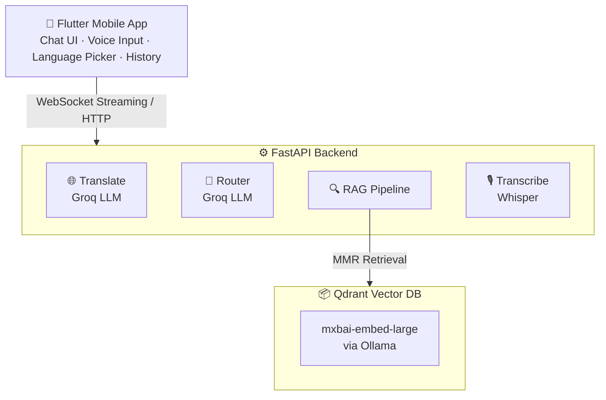

**🔄 Request Flow:**

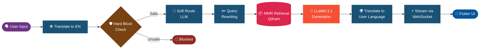

---

## 🛠️ Tech Stack

<div align="center">

| Layer | Technology | Purpose |
|:---:|:---:|:---|
| 📱 Mobile Frontend |  | Cross-platform mobile app |
| 🖥️ Web Prototype |  | Phase 1 validation |
| ⚙️ Backend API |  | REST + WebSocket server |
| 🧠 LLM |  | Response generation |
| 🔢 Embeddings |  | Text vectorisation |
| 📦 Vector DB |  | Medical knowledge store |
| 🎙️ Voice |  | Audio transcription |
| 🔌 Realtime | `WebSockets` | Token streaming |
| 💾 Local Storage | `Hive (Flutter)` | Chat history persistence |
| 📊 Evaluation | `RAGAS Framework` | RAG quality metrics |

</div>

---

## 📊 Evaluation Results

> Evaluated using the **RAGAS framework** across **15 women's health queries** covering PCOS, menopause, pregnancy, UTI, anemia, endometriosis, mental health, and more.

<div align="center">

| Metric | Score | Status |
|:---:|:---:|:---:|
| 🎯 Answer Relevancy | **93.7%** | ✅ Excellent |
| 🔍 Context Precision | **89.8%** | ✅ Excellent |
| 🤝 Faithfulness | **78.3%** | ⚠️ Good |
| 📚 Context Recall | **72.2%** | ⚠️ Good |

</div>

> 📁 Full evaluation results available in `Streamlit_Web_App/eval_results.csv`

---

## 📸 Screenshots

### 🖥️ Streamlit Web App

| Chat Interface | Multilingual Support |
|:---:|:---:|
| 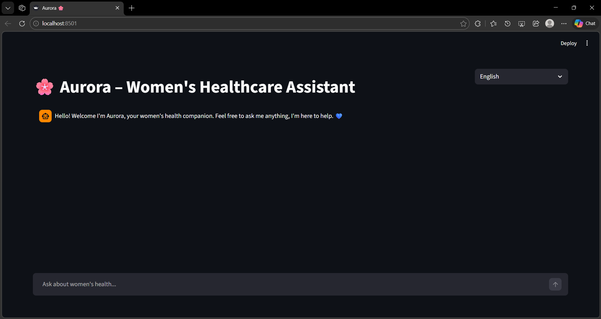 | 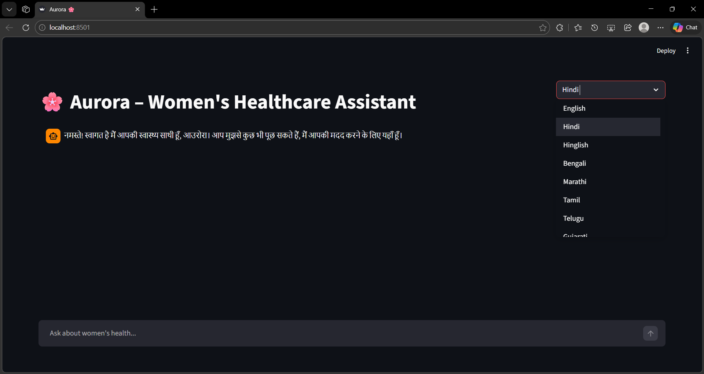 |

### 📱 Flutter Mobile App

| Dark Home | Light Home | Topic Grid | Category Questions |
|:---:|:---:|:---:|:---:|
| 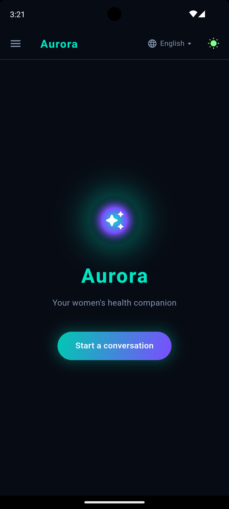 | 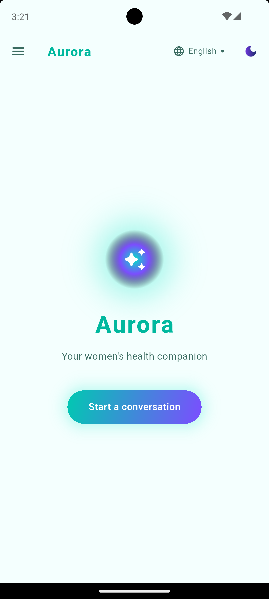 | 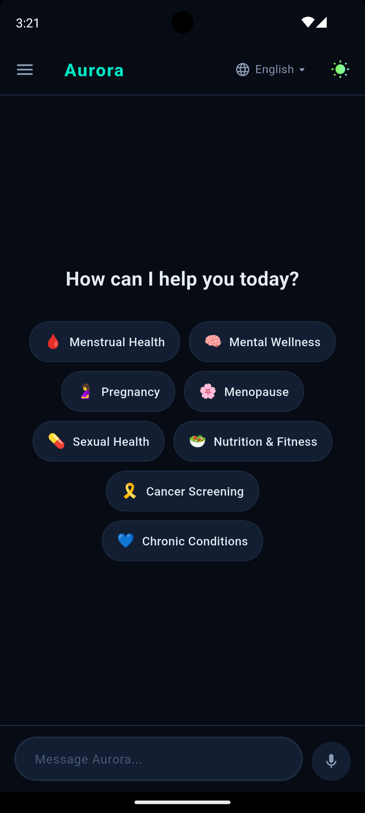 | 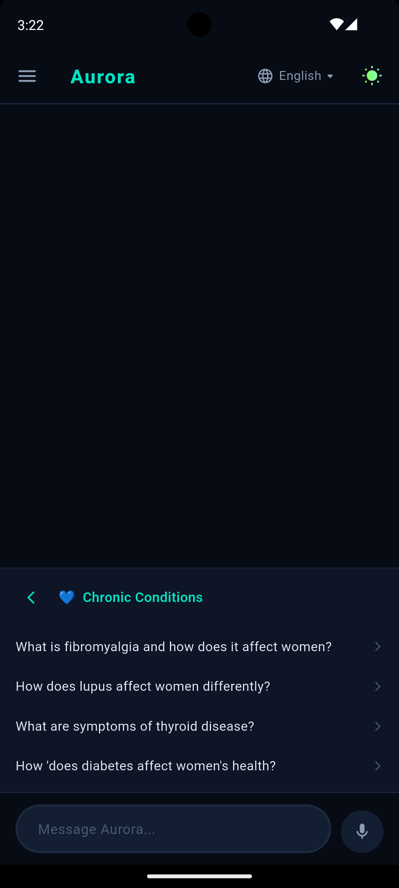 |

| AI Response | Voice Recording | Speech to Text | Language Picker |
|:---:|:---:|:---:|:---:|
| 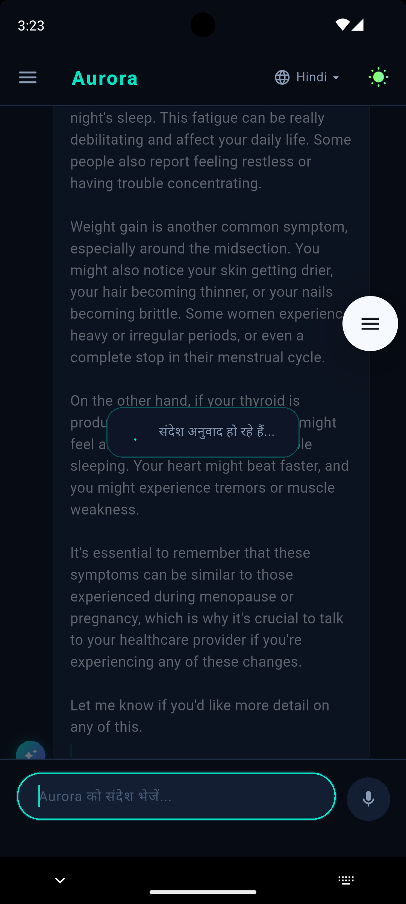 | 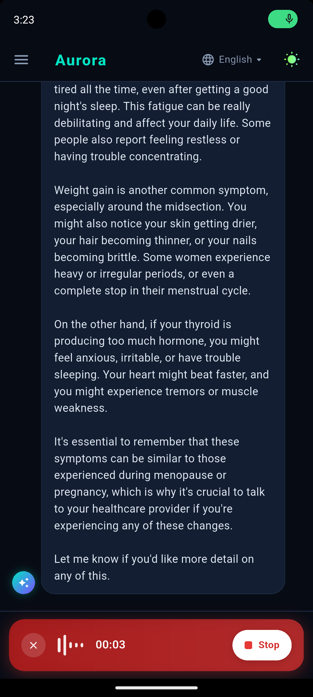 | 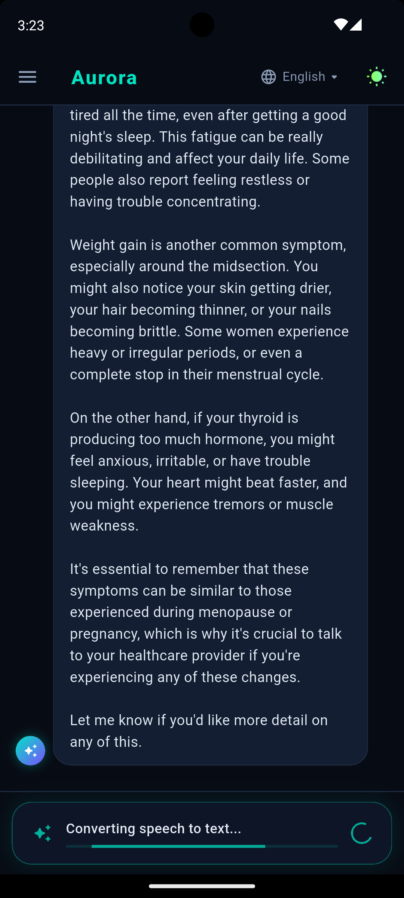 | 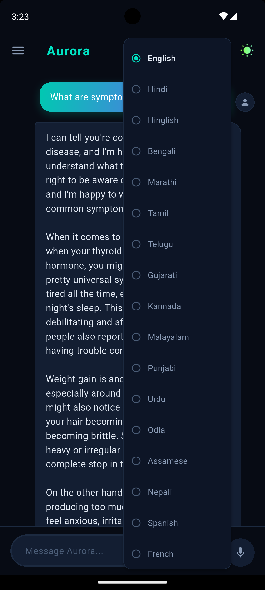 |

---

## 🌍 Supported Languages

<details>
<summary><b>🇮🇳 22 Indian Regional Languages (click to expand)</b></summary>

<br/>

| Code | Language | Script |
|:---:|:---:|:---:|
| `hi` | Hindi | Devanagari |
| `bn` | Bengali | Bengali |
| `mr` | Marathi | Devanagari |
| `ta` | Tamil | Tamil |
| `te` | Telugu | Telugu |
| `gu` | Gujarati | Gujarati |
| `kn` | Kannada | Kannada |
| `ml` | Malayalam | Malayalam |
| `pa` | Punjabi | Gurmukhi |
| `ur` | Urdu | Arabic |
| `or` | Odia | Odia |
| `as` | Assamese | Bengali-Assamese |
| `ne` | Nepali | Devanagari |
| `kok` | Konkani | Devanagari |
| `ks` | Kashmiri | Arabic |
| `sd` | Sindhi | Arabic |
| `mai` | Maithili | Devanagari |
| `sat` | Santali | Ol Chiki |
| `mni` | Manipuri | Meitei Mayek |
| `brx` | Bodo | Devanagari |
| `doi` | Dogri | Devanagari |
| `hinglish` | Hinglish | Latin |

</details>

<details>
<summary><b>🌐 International Languages (click to expand)</b></summary>

<br/>

`Spanish` • `French` • `German` • `Arabic` • `Portuguese` • `Indonesian` • `Japanese` • `Korean` • `Chinese`

</details>

---

## 📁 Project Structure

<details>
<summary><b>📂 Click to expand full structure</b></summary>

```
Aurora/
├── 🖥️ Streamlit_Web_App/           # Phase 1 — Web prototype
│   ├── app.py                      # Streamlit chat interface
│   ├── ingest.py                   # Document ingestion script
│   ├── evaluate.py                 # RAGAS evaluation script
│   ├── eval_results.csv            # Evaluation results
│   ├── qdrant_db/                  # Local Qdrant vector DB (not committed)
│   ├── Aurora_Datasets/            # Medical documents (not committed)
│   └── .env                        # API keys (not committed)
│
├── ⚙️ Backend_FastAPI/              # Phase 2 — Production backend
│   ├── app/
│   │   ├── main.py                 # FastAPI app, CORS, routes
│   │   ├── websocket.py            # WebSocket handler + streaming
│   │   ├── rag.py                  # RAG pipeline + query rewriting
│   │   ├── router.py               # Query classification
│   │   ├── translate.py            # Bidirectional translation
│   │   ├── llm.py                  # Groq LLM wrapper
│   │   ├── embeddings.py           # Ollama embeddings
│   │   ├── qdrant_store.py         # Vector store + MMR retriever
│   │   ├── response_banks.py       # Humanized response templates
│   │   ├── models.py               # Pydantic models
│   │   └── routers/
│   │       └── transcribe.py       # Groq Whisper endpoint
│   ├── ingest.py                   # Document chunking + ingestion
│   ├── aurora.bat                  # One-click backend launcher (Windows)
│   └── .env                        # API keys (not committed)
│
├── 📱 frontend_flutter/             # Phase 2 — Mobile frontend
│   └── lib/
│       ├── main.dart
│       ├── core/
│       │   ├── config/server_config.dart
│       │   └── websocket/ws_service.dart
│       ├── features/chat/chat_screen.dart
│       └── state/chat_controller.dart
│
├── 🧪 ML_Datasets/                  # Women's health ML datasets (not committed)
├── 🤖 ml_models/                    # Experimental ML models (in progress)
└── 📄 requirements.txt
```

> ⚠️ `Aurora_Datasets/`, `ML_Datasets/`, `qdrant_db/`, and `.env` files are excluded via `.gitignore`. You will need to provide your own datasets and API keys.

</details>

---

## 🚀 Getting Started

### Prerequisites

```
✅ Python 3.10+
✅ Flutter 3.x
✅ Ollama installed and running  →  https://ollama.com/download
✅ Groq API key (free)           →  https://console.groq.com
```

### Step-by-Step Setup

**1️⃣ Clone the repository**
```bash
git clone https://github.com/GeetishM/Aurora.git
cd Aurora
```

**2️⃣ Create your `.env` files**

Both `Streamlit_Web_App/` and `Backend_FastAPI/` need a `.env`:
```env
GROQ_API_KEY=your_groq_api_key_here
```

**3️⃣ Install Python dependencies**
```bash
pip install -r requirements.txt
```

**4️⃣ Pull the embedding model**
```bash
ollama pull mxbai-embed-large
```

**5️⃣ Add medical documents and ingest**
```bash
# For Streamlit
cd Streamlit_Web_App && python ingest.py

# For FastAPI
cd Backend_FastAPI && python ingest.py
```

**6️⃣ Flutter setup**
```bash
cd frontend_flutter
flutter pub get
```

---

## ▶️ Running the App
<table>
  <tr>
    <td width="50%" valign="top">
      <h3>⚡ Option A — Streamlit (quickest)</h3>
      <pre><code>cd Streamlit_Web_App
streamlit run app.py</code></pre>
    </td>
    <td width="50%" valign="top">
      <h3>📱 Option B — Flutter Mobile App</h3>
      <pre><code># Terminal 1 — Start Ollama
ollama serve

# Terminal 2 — Start FastAPI backend
cd Backend_FastAPI
uvicorn app.main:app --reload --host 0.0.0.0 --port 8000

# Terminal 3 — Start Flutter app
cd frontend_flutter
flutter run</code></pre>
    </td>
  </tr>
</table>

---

## 📡 API Reference

<div align="center">

| Endpoint | Method | Description |
|:---:|:---:|:---|
| `/` | `GET` | Health check |
| `/ws/chat` | `WebSocket` | Streaming chat |
| `/api/transcribe` | `POST` | Audio → text (Whisper) |
| `/translate` | `POST` | Text translation |

</div>

**WebSocket Message Format**

```jsonc
// Send
{
  "message": "What are symptoms of PCOS?",
  "language": "hi"
}

// Receive (streaming)
{ "type": "chunk", "text": "PCOS के लक्षणों" }
{ "type": "final", "text": "...", "sources": [...] }
```

---

## 🗂️ Query Categories

Aurora intelligently routes queries into **8 health categories**:

<div align="center">

| Category | Examples |
|:---:|:---|
| 🩺 `daily_symptom_support` | Cramps, headaches, fatigue |
| 🌡️ `hormonal_life_stages` | Menopause, perimenopause, puberty |
| 🥗 `holistic_wellness_lifestyle` | Nutrition, exercise, sleep |
| 💆 `mental_emotional_resilience` | Anxiety, depression, stress |
| 🔬 `preventive_care_screening` | Mammograms, Pap smears |
| 🛡️ `safety_support_advocacy` | Domestic violence resources |
| 👋 `greeting` / `farewell` | Conversational turns |

</div>

---

## 👩‍💻 Credits & Collaborators

<div align="center">

Made with 🌸 for women's health accessibility

<table>
  <tr>
    <td align="center">
      <a href="https://github.com/GeetishM">
        <br/>
        <b>Geetish Mahato</b>
      </a>
    </td>
    <td align="center">
      <a href="https://github.com/anamikadey099">
        <br/>
        <b>Anamika Dey</b>
      </a>
    </td>
    <td align="center">
      <a href="https://github.com/Pragya-Kumar">
        <br/>
        <b>Pragya Kumar</b>
      </a>
    </td>
  </tr>
</table>

<br/>

⭐ **If Aurora helped you or inspired you, please consider giving it a star!** ⭐


</div>
